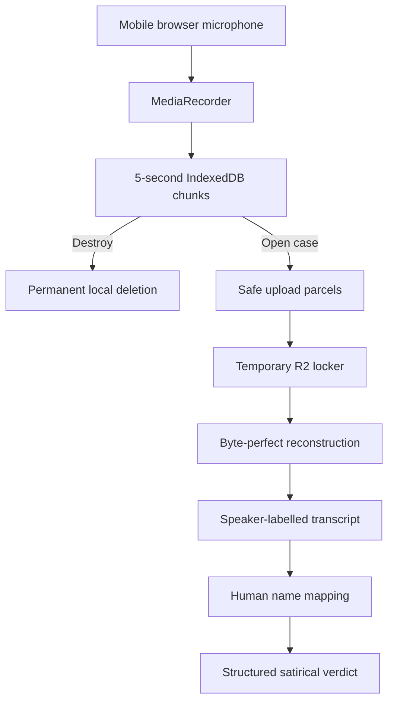

# Architecture

Status: **prototype architecture v0.1.1**
Last updated: **9 August 2026**

This document exists to prevent implementation drift. Any later change to the
privacy boundary, recording lifecycle, speaker resolution or satire boundary
must be recorded in `DECISIONS.md` before it is implemented.

## Non-negotiable invariants

1. Starting a recording never calls OpenAI or any other remote service.
2. Discarded recordings never leave the device and incur no API cost.
3. **OBJECTION!** starts the case, but audio continues for closing arguments.
4. Upload occurs only after an explicit objection followed by the 90-second
   timeout / **Judge us now**, or after explicitly opening a held recording.
5. Raw audio is deleted locally only after transcription succeeds.
6. Speaker diarisation produces anonymous labels; humans map labels to names.
7. The API key exists only in the server runtime, never browser code or Git.
8. Accurate transcript and invented satire remain distinct in data and UI.
9. No cloud database or long-term conversation history in the prototype.
10. Appeals reuse the transcript and therefore do not pay for transcription
    again.
11. The full recording is divided only for transport, reconstructed byte for
    byte before transcription, and never semantically trimmed without a new
    product decision.
12. Temporary server-side audio parcels are deleted after every transcription
    attempt; the recoverable device copy remains until transcription succeeds.

## System shape



There are three trust zones:

| Zone | Contains | Persistence |
|---|---|---|
| Device | Raw audio chunks, transient transcript and verdict | Audio until discard or successful transcription; other state only for the page session |
| Actually. server | API key and narrow upload, transcription and verdict routes | None |
| Temporary R2 locker | Bounded encrypted-at-rest audio parcels after explicit case opening | Deleted after the transcription attempt; interrupted parcels are deleted by the client where possible and stale parcels are purged on later uploads |
| OpenAI API | Submitted audio for transcription and transcript for verdict | Requests use the relevant API; verdict requests set `store: false` |

## State machine

| State | Entry | Exit |
|---|---|---|
| `idle` | App opens or case is burnt | Start listening, recover evidence, demo |
| `listening` | Microphone begins, local chunks start | Objection, destroy, 60-minute hold |
| `objected` | Objection timestamp recorded | Auto-judge, judge now, extend 60 seconds |
| `held` | One-hour cap reached without objection | Explicitly open case or destroy |
| `transcribing` | Audio split into safe transport parcels | Reassembly, transcription, identity parade or retryable error |
| `identity` | Anonymous segments returned | Issue verdict |
| `judging` | Transcript and names submitted | Verdict or retryable error |
| `verdict` | Structured verdict returned | Appeal, share, Evidence Locker, burn case |
| `error` | A recoverable operation fails | Retry, demo or return to start |

`held` is essential: reaching the one-hour cap must not silently spend money.

## Recording design

- Browser `MediaRecorder` captures mono audio at a requested 32 kbit/s.
- The implementation chooses Opus/WebM when supported and falls back to a
  browser-supported audio container.
- A `dataavailable` event fires every five seconds.
- Each chunk is kept in memory for the active session and independently written
  to IndexedDB for crash recovery.
- A screen Wake Lock is requested where available.
- Estimated maximum size at 32 kbit/s is about 14.4 MB for one hour, below the
  transcription endpoint’s documented 25 MB file limit.

Important mobile-web limitation: operating systems may suspend a web app when
the screen is locked or the browser is killed. Wake Lock improves the foreground
case but does not make a PWA equivalent to a native background recorder. A
native wrapper is a later decision, not a hidden prototype assumption.

## Upload and transcription boundary

The Sites ingress limit is lower than OpenAI’s 25 MB transcription limit. A
single 2.15 MB mobile upload was rejected with HTTP 413 during the first Pixel 5
test. The app therefore uses a bounded temporary upload protocol:

1. `POST /api/transcribe/session` creates an opaque upload ticket.
2. The browser slices the original Blob into 768 KiB byte ranges and sends each
   range to `PUT /api/transcribe/part` with up to three concurrent requests.
3. `POST /api/transcribe` reassembles those ranges in order and verifies the
   exact total byte count before contacting OpenAI.
4. The temporary R2 objects are deleted in a `finally` path whether OpenAI
   succeeds or fails. Local IndexedDB evidence is deleted only on success.

The split is a transport operation, not an audio edit. Arbitrary WebM byte
ranges are never transcribed separately, so the media header, chronology and
speaker context remain intact.

`POST /api/transcribe`

- Accepts only a small JSON upload ticket after all parcels arrive.
- Reconstructs one audio `Blob` under 25 MB and checks it matches the declared
  byte count.
- Reads `OPENAI_API_KEY` only on the server.
- Calls `/v1/audio/transcriptions` with:
  - model `gpt-4o-transcribe-diarize`
  - response format `diarized_json`
  - chunking strategy `auto`
- Returns only normalised `{ speaker, text, start, end }` segments.
- Does not attempt to guess real names.

The browser shows parcel upload progress. It safely handles non-JSON hosting
errors instead of surfacing a JSON parser message. If any step fails, the full
device-local audio remains available for retry or deliberate destruction.

## Identity resolution

Diarisation answers “which voice?” rather than “which person?”. The UI therefore
shows the first usable quotation for each detected speaker. A human enters the
name beside that quotation. Blank fields deliberately remain generic labels.

Reusable voice profiles are excluded from v0.1 because they add biometric data,
storage and onboarding without proving the central joke.

## Verdict boundary

`POST /api/verdict`

- Accepts transcript segments, the speaker-name map, an optional description,
  an optional previous verdict and appeal number.
- Caps transcript input at 180,000 characters.
- Calls the Responses API with `store: false`, low reasoning effort and a strict
  JSON Schema.
- Defaults to `gpt-5.6-luna`; `OPENAI_VERDICT_MODEL` can override it.
- Returns a typed `ActuallyVerdict` used directly by the UI.

The prompt lives in `lib/verdict-prompt.ts`, not in the route or page. Tone and
safety changes must be made there and recorded in `DECISIONS.md`.

## Repository map

```text
app/
  actually-app.tsx        Client state machine and UI
  api/transcribe/route.ts Narrow transcription proxy
  api/verdict/route.ts    Structured verdict proxy
  globals.css             Complete visual system
  layout.tsx              Metadata and document shell
  manifest.ts             Installable-app manifest
lib/
  demo.ts                 API-free demonstration case
  evidence-store.ts       IndexedDB audio chunks
  types.ts                Shared domain types
  verdict-prompt.ts       Tone contract and output schema
public/
  sw.js                   Small app-shell service worker
docs/
  HANDOVER.md             Current checkpoint and next work
```

## Security and deployment

The source repository is intentionally public, while the deployed app remains
owner-only because it uses a single personal API key. A public app rollout
requires, at minimum:

- user authentication;
- per-user and per-IP rate limits;
- request-size enforcement at the edge;
- per-case cost budgets and a hard monthly circuit breaker;
- a clear recording-consent flow appropriate to the launch jurisdictions;
- abuse monitoring without retaining raw private conversation content;
- a privacy notice and defined data-retention policy;
- direct billing or a controlled credit model.

Do not expose `OPENAI_API_KEY`, put it in a client environment variable, or
commit it to GitHub.

## Test strategy

Automated:

- Production build and rendered-HTML checks
- Lossless split/reassembly test using the exact 2,152,329-byte failed payload
- Full upload-route test with an in-memory R2 double, mocked OpenAI response and
  an assertion that temporary objects are deleted
- TypeScript compilation through the build
- State/store unit tests (next addition)

Manual mobile acceptance:

1. Grant microphone access.
2. Record for at least two minutes and confirm the screen remains awake.
3. Destroy a recording and confirm no network request occurs.
4. Record two voices, object, continue talking and submit early.
5. Confirm each voice has a recognisable quotation before entering names.
6. Confirm raw local evidence is gone after transcription.
7. Generate and appeal a ruling without a second transcription request.
8. Share a verdict using the Android share sheet.
9. Interrupt a recording by closing the tab and test recovery.
